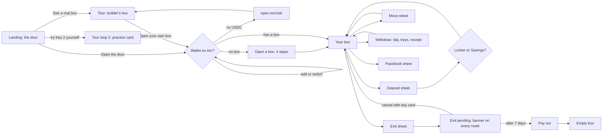
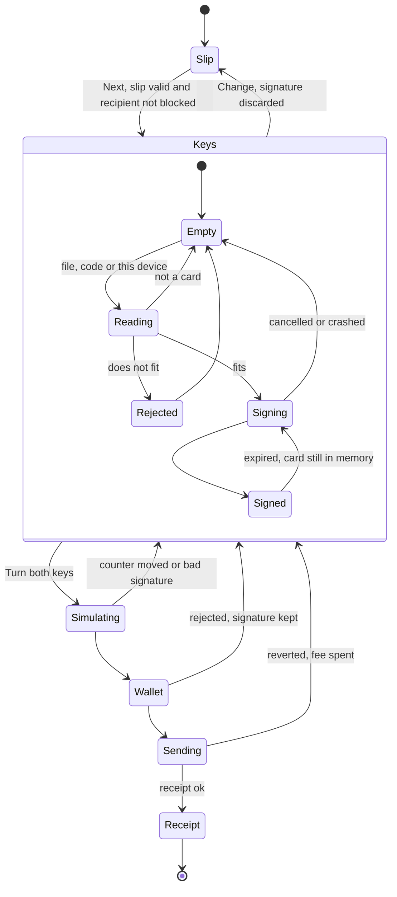

# UX journey: Arc Guard

This file decides the order of screens, every state, the layout and the trust rules. It doesn't repeat strings (they're in `copy.md`, cited by key such as `err.card.otherBox`) or motion and sound values (they're in `sound-motion.md`, cited by name). Inputs: the spec, the build plan, concepts A, B and C, and the checks in §1, which were run on 25 Sep 2026.

Tags: **[measured]** means I ran it today. **[docs]** means it comes from written documentation. **[INFERENCE]** means not verified. **[CHECK]** means Phase 2 has to confirm it.

---

## 0. Decisions

1. **Two buttons and one link on the landing.** [Open the door] connects a wallet. [See a real box] needs no wallet. A text link, "or try Key 2 yourself →", jumps straight to the practice step. There is no pretend-money box (§6.1).
2. **Both buttons open the door.** Putting the hero moment behind a wallet popup loses every judge who has no wallet. The first click on either button unlocks audio, as the sound-motion policy requires.
3. **Path A (no wallet) reaches a real explorer transaction by 0:45 and finishes the story by 2:00. Path B (wallet) reaches the judge's own two-key transaction at about 1:25.**
4. **A withdrawal goes slip → keys → receipt.** The slip is locked before signing starts. Loading the key card starts signing, so there is no separate Sign button. [Turn both keys] opens the wallet popup, and the keys only turn when the receipt arrives (sound-motion rule 1).
5. **Every check runs before any wait or fee:**
   - the card fits (compare its public key with the box's key locally),
   - the recipient isn't on the blocked list (`isBlocklisted`),
   - enough USDC stays in the wallet for fees,
   - `simulateContract` passes for the transaction.

   Nobody waits 8 s for a signature that was doomed from the start, and nobody pays a fee for a failure we could have predicted.
6. **Interest moves at its real speed.** The 6-decimal value changes only when Arc's value changes, which is about once every 9 minutes on 100 USDC (§1.2). The sign of life is a heartbeat: "Checked with Arc 3 s ago · block 22,660,862". No made-up digits in between. `sound-motion.md` has been updated to match.
7. **At least 0.05 USDC always stays in the wallet.** On Arc the fee and the deposit come out of the same USDC balance. If someone deposits everything, the box is stranded, because nothing is left to pay the withdrawal fee. So the "All but fees" button deposits the wallet balance minus 0.05.
8. **A pending emergency exit takes over every screen:** a sticky red banner on every route, a red tag on the box, the tab title `EXIT PENDING · …`, and a plain-words check of whether the payout address is the holder's own.
9. **Anyone can view any box read-only at `/box/:address`.** "Cancel with key card" works there from **any** wallet, because an owner whose wallet was stolen must be able to cancel from a different one.
10. **On a phone, the app is one room plus sheets.** No tab bar and no sidebar. Each sheet is a route, so the phone's back button closes it.

---

## 1. The facts this design rests on

### 1.1 Measured today (M-series Mac, Bun, Arc mainnet public RPC)

| What | Value |
|---|---|
| SLH-DSA-SHA2-128s signing (`@noble/post-quantum`) | 857–859 ms over 3 runs **[measured]** |
| Key generation | 126 ms. Signing takes about 6.8× as long as keygen, so keygen on a phone is about 0.4–1.2 s **[measured]** |
| Verifying on the device | 1.9 ms **[measured]** |
| Sizes | public key 32 bytes · secret key 64 bytes · signature 7,856 bytes **[measured]** |
| Arc checks a signature made in the browser | `eth_call` to `verifySlhDsaSha2128s` at `0x1800…0004` returns `true`. Flip one byte and it returns `false`. The round trip took 255 ms, and `estimateGas` gave 382,528. **No wallet is needed.** **[measured]** |
| Block time | 0.51 s (100 blocks in 51 s) **[measured]**. Finality is under 1 s **[docs]** |
| Galaxy USDC vault | A Morpho **Vault V2** at `0x8E357432CC12ff425c36432F312968aEb16112AF`. Its share token is `arcUSDC` with 18 decimals, and its asset is USDC at `0x3600…` **[measured]** |
| Rate | 0.0558% a year (Morpho API `apy` and `netApy`), 0.0543% on average. Performance and management fees are both 0 **[measured]** |
| Size | 79.8M USDC deposited, 57.2M USDC that can be withdrawn right now **[measured]** |
| How interest accrues | `totalAssets()` rose by 18,363 millionths of a USDC in 12 s, so the value grows continuously in read calls **[measured]** |
| Vault V2 limits | `maxDeposit` returned 0. Morpho's docs say all V2 `max*` functions always return 0, so nothing can be read ahead of time and we have to simulate instead **[measured, docs]** |
| Share price | 1 share = 0.9995 USDC **[measured]** |
| Public RPC | Allows browser calls from any origin (it echoes back `Origin`). `eth_getLogs` accepts at most 9,999 blocks; 10,000 fails with "requested range too large". About 3 quick calls go through, then "rate limit exceeded". Logs include `blockTimestamp`. JSON-RPC batches work, but each call inside counts toward the limit **[measured]** |
| Explorer | explorer.arc.io runs Blockscout. `/tx/{hash}?tab=logs` opens with the **Logs** tab selected (checked in a real browser). Its APIs sit behind a Cloudflare challenge: scripts get a 403 "Just a moment…". **So the passbook must not be built on the explorer's API.** **[measured]** |

### 1.2 How fast interest really moves (0.0558% a year)

Seconds between changes of the 6th decimal = **56,516 ÷ balance**.

| In Savings | Earns per year | 6th decimal changes every |
|---|---|---|
| 10 USDC | 0.0056 (about ½¢) | 94 min |
| 50 | 0.028 (about 3¢) | 19 min |
| 100 | 0.056 (about 6¢) | 9.4 min |
| 1,000 | 0.56 | 57 s |
| 10,000 | 5.58 | 5.7 s |
| 56,516 | 31.5 | 1 s |

So a judge will almost never see the 6-decimal number move during a 2-minute visit. That's the truth, and the design is built around it (§4.3).

### 1.3 Fees shown to users

- **Actions that need both keys** (withdraw, cancel an exit, replace a card): about 440k gas, which is about **0.009 USDC** at the 20 gwei floor **[docs/spec]**.
- **Simple actions** (open, give permission, deposit, start an exit): about **0.001 USDC** **[INFERENCE: roughly 50–80k gas]**.
- **Moving money into Savings** goes through the vault's adapters, so show the live estimate, never a fixed number.
- **How to show a fee:** always "about X USDC, paid to Arc", rounded **up** from `estimateGas × current base fee`. Set `maxFeePerGas` to at least 30 gwei, because the mempool silently drops anything under 20 gwei.

---

## 2. The judge's 2 minutes

### 2.1 Before the click

The DoraHacks description lists these links, in this order:

1. the app;
2. "The real two-key withdrawal": `explorer.arc.io/tx/{DEMO_WITHDRAW_TX}?tab=logs`;
3. the verified contract;
4. the repo.

If the app breaks, links 2 and 3 still prove the product works.

### 2.2 Path A: no wallet (the default for most judges)

Hard floor: a real transaction on the explorer by **0:45**. The whole story by **2:00**.

| Time | Screen | Judge sees / hears | Judge does | What it proves |
|---|---|---|---|---|
| 0:00–0:01.5 | Landing | The door (inline SVG + CSS, so it paints before JS), nameplate, headline and plaque. **[See a real box] is primary because no wallet was detected.** Also [Open the door], the link "or try Key 2 yourself →", and a strip: `LIVE ON ARC MAINNET · OPEN SOURCE (MIT) · CONTRACT VERIFIED ↗` | reads | It's live on mainnet, open source and verified |
| 0:01.5–0:06 | | `landing.headline`, `landing.sub`, `plaque.engraving` | reads | |
| 0:06 | | | clicks **See a real box** | Audio unlocks. The demo box's data was already fetched while the page was idle |
| 0:06–0:09 | Door | Bolts move from 0 to 640 ms, the door swings until 2,950 ms, and `vaultDoor()` plays. A tap skips it | | |
| 0:09–0:10 | Box room | The builder's box slides out of the wall (900 ms). `tour.ribbon` and the holder's address appear, plus the tour rail: ① Box ② Two keys ③ Passbook ④ Lost card | | |
| 0:10–0:22 | ① Box | Locker: 20.00 USDC. Savings: 30.00 USDC, with `box.savings.rate`, "Galaxy USDC vault on Morpho", "Earned so far 0.000412" and the risk line. Heartbeat: "Checked with Arc 2 s ago · block 22,660,9xx", with a brass dot that pulses on each poll. Passbook preview: the last 3 stamped lines | reads | The balances are real, read just now |
| 0:22 | | | clicks **Next: the two keys** | |
| 0:22–0:26 | ② Keys | The withdraw sheet in replay mode, filled in from the real withdrawal's receipt: "5.00 USDC from Locker → 0x…". Key 1 shows "Owner's wallet ✓". Key 2 is empty. Panel: `practice.lead` | reads | |
| 0:26 | | | clicks **Try Key 2 yourself** | |
| 0:26–0:28.5 | Practice | In sequence: the card is cut (126 ms, shown over 600 ms) → it slides into Key 2 (`keyInsert()`) → the signing bar runs with a tick (858 ms) → `PQ SIGNED` and "7,856-byte signature, made on this device" → `practice.step3.working` (about 255 ms) → **GENUINE** stamp and `practice.ok` with the real time in ms | watches | A real post-quantum signature, checked live by Arc mainnet, with no wallet |
| 0:28.5–0:31 | | | clicks **Change one letter** | |
| 0:31–0:32 | | The slip changes from "10.00" to "90.00". Arc checks again → **REFUSED** (`practice.bad`), and `errorBuzz()` plays | reads | An altered slip fails the check on-chain |
| 0:32 | | | clicks **Watch the owner's real withdrawal** | |
| 0:32–0:35 | Replay | The keys turn (320 ms), then the clunk, the box slides out (900 ms), the **WITHDRAWN** stamp lands with KEY 2 OK, and the receipt line types in (about 2.1 s, per sound-motion). Caption: "Replayed from Arc's public record · {date} {time} · fee {fee} USDC". The receipt link takes keyboard focus | watches | |
| 0:35–0:40 | | "What happened on Arc", in 3 lines: the recipient was checked against the blocked list → Arc's built-in checker verified the 7,856-byte key-card signature → the USDC moved, and the fee was paid in USDC | reads | Names the Arc features it uses |
| 0:40 | | | clicks **See it on Arc's public record ↗** (opens a new tab) | |
| 0:40–1:10 | Explorer | The `?tab=logs` view: Success, method `withdraw`, decoded `PQVerified` and `Withdrawn` events, about 8 KB of input, and the fee in USDC | inspects | **A real transaction** |
| 1:10–1:25 | ③ Passbook | OPENED · DEPOSITED · SAVED · WITHDRAWN (KEY 2 OK) · NEW CARD · EXIT STARTED · CANCELLED, each with Receipt ↗. An INTEREST line marked "Calculated, not a transaction" | taps a line or two | Every line has a receipt |
| 1:25–1:45 | ④ Lost card | The 7-day exit in three facts (it works like a bank's time lock), the demo box's real EXIT STARTED and CANCELLED receipts, and a sample pending banner labelled "Example: this box has no exit pending" | reads | Recovery exists, and it was actually used on mainnet |
| 1:45–2:00 | End card | "What this uses on Arc": fees in USDC · the PQ checker at `0x1800…0004` · the blocked list at `0x1800…0001` · sub-second finality (a stamp means the action is final) · the Galaxy USDC vault on Morpho · Circle App Kit Earn for the rate *(only if used)*. Buttons: [Open your own box] and [Read the code ↗] | | |

**Fastest judge (45 s):** landing → See a real box → Next → Try Key 2 yourself → Watch the owner's real withdrawal → explorer.

### 2.3 Path B: wallet holding at least ~1.1 USDC on Arc

Six wallet popups, or seven if the judge picks Savings. Target: about 1:25 for someone used to wallets.

| Time | Step | Popup |
|---|---|---|
| 0:00 | Landing. A wallet is detected, so [Open the door] is primary | |
| 0:04 | Connect sheet: detected wallets first (EIP-6963), then WalletConnect. On a phone browser with no wallet: "Open in MetaMask" (`metamask.app.link/dapp/{host}`) and "Open in Coinbase Wallet" (`go.cb-w.com/dapp?cb_url=`) | |
| 0:06–0:09 | Connect | 1 |
| 0:09–0:14 | We say first: "Your wallet will ask to add Arc." Then `wallet_switchEthereumChain`, falling back to `wallet_addEthereumChain` on error 4902 (Arc · 5042 · USDC with 18 decimals · rpc.mainnet.arc.io · explorer.arc.io) | 2 |
| 0:14–0:17 | The door opens (2.95 s, skippable). Meanwhile the app checks: does this wallet have a box? Is the USDC balance at least 0.01? What's the fee estimate? | |
| 0:17 | `/open`, step 2: "Your box: No. 4271" → [Cut my key card] | |
| 0:19–0:20 | The card appears (126 ms to generate, plus the reveal animation) | |
| 0:21 | Download saves `pq-guard-key-card-box-4271.json`. On a phone: the share sheet, Copy or Print | |
| 0:24–0:30 | [Check my card]: drag the downloaded file back in → "Card checked. It fits Box No. 4271." Tick the confirmation box. Optionally tick "Remember on this device", which saves about 5 s at withdrawal | |
| 0:32–0:39 | Step 4. We say first: the fee is about 0.001 USDC, and "Some wallets label it ETH; it's USDC." Then `open` | 3 |
| 0:39 | OPENED stamp → the box → the deposit slip opens on its own ("Not now" closes it) | |
| 0:40–0:50 | Amount: 1 → [Give permission] for **exactly** 1.00 USDC | 4 |
| 0:50–0:57 | [Deposit 1.00 USDC] → the Locker number rolls up, and DEPOSITED is stamped | 5 |
| 0:57–1:00 | The choice → Keep in Locker. (Choosing Savings adds one popup and about 8 s) | (6) |
| 1:00–1:05 | Withdraw → From Locker: All · Send to: your wallet ✓ · summary and fee → [Next: keys] | |
| 1:05–1:11 | Key 2: [Use card on this device] or drop in the file → it fits → signing takes 0.86 s → PQ SIGNED | |
| 1:11–1:19 | [Turn both keys] → simulation passes → the wallet opens | 6 |
| 1:19–1:22 | Receipt → the keys turn, clunk, the box slides out, WITHDRAWN, the receipt line | |
| 1:22–1:25 | See it on Arc's public record ↗ → the judge's own `PQVerified` event | |

Ways to cut popups, only if Phase 2 has time. The step UI handles 1 to 3 steps either way.
- **Batching:** send open + permission + deposit as one batch (EIP-5792 `wallet_sendCalls`) when `wallet_getCapabilities` reports atomic support on chain 5042 **[CHECK for each wallet]**. Otherwise fall back to separate steps.
- **Permit:** USDC `permit` (FiatTokenV2 supports EIP-2612) turns "give permission" into a signature with no fee.

### 2.4 Path C: wallet, but no USDC on Arc

- Read the wallet's balance right after it connects. If it's under 0.01 USDC, `/open` shows `open.noUsdc` **before** any card is cut, so nobody saves a card they can't use yet.
- Buttons:
  - [See a real box] (primary)
  - `open.noUsdc.btn`
  - Copy address
  - "How to get USDC on Arc ↗" **[CHECK: the best consumer route on mainnet]**

### 2.5 Differences on a phone

- **Door:** when `pointer: coarse` matches, it scales and fades in 600 ms (concept A), which saves about 2.3 s.
- **Practice:** keygen takes 0.4–1.2 s and signing 3–8 s. The waiting text changes with elapsed time (`sign.wait.0…4`). Path A takes about 6 s longer overall.
- **Explorer:** it opens in a new tab, and iOS may unload the app's tab. The current tour stop is saved in `sessionStorage`, so the tour picks up again at ③.
- **Signing in the background:** the tab should stay in front while signing. If the tab gets hidden and the browser kills the worker, restart signing when the tab is visible again (the card bytes are still in memory) and say so. This needs a new string.
- **Saving the card:** wallet apps' built-in browsers often block downloads. Save the card through the share sheet (`navigator.canShare({files})`), Copy or Print (`open.step3.downloadHelp`).

### 2.6 What Phase 2 must set up for this journey

- [ ] **Verify the contract** on explorer.arc.io before submitting. Otherwise the explorer shows raw hex logs, and the journey's last screen falls flat.
- [ ] **Set up the builder's demo box.** Deposit about 30. Move about 20 to Savings. Make one two-key withdrawal (that's `DEMO_WITHDRAW_TX`). Start and cancel one exit. Replace the card once. The passbook then shows every stamp except EXIT PAID.
  - Keep at least 10 USDC in each compartment during the review window.
  - With 1,000 USDC in Savings, the 6th decimal would move about once a minute. Nice, but not needed.
- [ ] **Config holds only three values:** `DEMO_OWNER`, `DEMO_WITHDRAW_TX` and `DEMO_EXIT_TXS`. The replay reads the amount, time and fee from the receipt live.
- [ ] **Show the passbook in about 1 s on a first visit.** The public RPC scans at most 9,999 blocks per `getLogs` call at about 0.5 requests a second, so scanning a box opened 3 days earlier takes about 51 calls, or roughly 100 s. Pick one approach:
  1. **Recommended:** the contract keeps a list of the block numbers where each holder's events happened. That can be a packed `uint32[]`, or `lastEventBlock` plus a `prevBlock` field in every event. Then it's one read call followed by single-block `getLogs` calls, newest first: 3 lines in the first burst (about 0.6 s), and the rest at one every 2 s.
  2. Store the holder's `openedAt` block and scan backwards from the newest block. This only works for young boxes.
  3. A server route that caches the history. This means more infrastructure.

  Also cache passbook lines in `localStorage`, keyed by holder and chain, so return visits load instantly.
- [ ] **Send every RPC call through one queue:** bursts of at most 3 calls, then one every 2 s, backing off when the RPC says "rate limit exceeded". The box polls with one multicall every 10 s while the tab is visible, pauses when it's hidden, and refreshes right after each of the user's own receipts.
- [ ] **Events must carry the USDC amount (`assets`) as well as `shares`** in `Moved`, `Withdrawn` and `EscapeExecuted`. Without it, the passbook can't show dollar amounts on Savings lines.
- [ ] **Preload the signing worker** and `@noble/post-quantum` while the landing page is idle (`requestIdleCallback`), so "Try Key 2 yourself" starts instantly.

---

## 3. Information architecture

### 3.1 Routes

| Route | Screen | Who sees it |
|---|---|---|
| `/` | Landing (the door) | everyone |
| `/open` | Open a box, in 4 steps | connected wallet with no box |
| `/box` | Your box | the connected holder |
| `/box/:address` | Any box, read-only. Shows "Cancel with key card" when an exit is pending | anyone |
| `/box/demo` | The builder's box with the tour rail (same as `/box/{DEMO_OWNER}`) | the no-wallet path |
| `?sheet=deposit · move · withdraw · passbook · exit · details` | Sheets that open over `/box*` | the back button closes them |
| `/how` | Read the plaque · Risks · Arc details · addresses | footer and plaque |

Routing rules:
- **Connected, box exists:** the landing says "Welcome back · Box No. 4271", and [Open the door] goes to `/box`. After the first visit in a session, the door takes 600 ms.
- **Connected, no box:** go to `/open`.
- **Wallet switched to another account:** load that account's box (`err.accountChanged`).
- **Wrong network:** reading still works, because the app reads from its own Arc RPC. Action buttons turn into [Switch to Arc].



### 3.2 Things and their names

Box (No., holder) · Locker · Savings (the jar) · Key 1 = your wallet · Key 2 = your key card · Passbook (entries and stamps) · Slips (deposit, move, withdraw) · Emergency exit (none → pending → ready → paid, or cancelled).

- **Names** follow the glossary in `copy.md` §2.
- **"Vault" means only the Galaxy USDC vault on Morpho.** The building is "the door" and "the box room". So `landing.door.opening` should read "The door is opening.", and concept A's fallback button "Open the vault" should read "Open the door".
- **The box number is decoration.** It's the last 4 hex characters of the address, converted to decimal, mod 10,000, shown as 4 digits. URLs and all logic use the full address. Never look anything up by box number.

### 3.3 What's always on screen

- **Header** (56 px on a phone, 64 px on desktop):
  - Left: the nameplate on desktop. On a phone, the box plate `No. 4271`, which opens the details sheet when tapped.
  - Right: the wallet chip `0x12ab…90cd · 12.34 USDC` (tap to switch or disconnect), then the sound toggle.
- **Banner slot** above the header. A phone shows only one banner at a time, highest priority first:
  1. exit pending: red, sticky, on every route, can't be dismissed;
  2. wrong network: amber, shown when an action is attempted;
  3. stale data: grey, "Last checked with Arc 1 min ago. Reconnecting…";
  4. `tour.ribbon`: ink.
- **Heartbeat:** "Checked with Arc 3 s ago · block 22,660,862". The seconds count up locally, and the block number updates on each poll. It turns amber after 30 s. On a phone it sits under Savings; on desktop, in the footer.
- **Footer:** `footer.disclosure` (always shown, at body size) · Source · Contract on Arc · How it works · Risks · Lost your key card?
- **Tab title:** `Box No. 4271 · Arc Guard`. While an exit is pending: `EXIT PENDING · Box No. 4271`, with the red-tag favicon.

### 3.4 Navigation rules

1. The box is home, and everything else is a sheet on top of it. The deepest it goes is box → sheet → confirm.
2. Sheets are routes, so the phone's back button closes a sheet instead of leaving the site.
3. A sheet can be closed while its transaction is still in flight.
   - The transaction keeps being tracked in a toast, and the box updates when the receipt arrives.
   - The pending transaction hash stays in `localStorage` until its receipt comes back. After a reload, the app shows "Checking your last action…" and settles it.
4. One primary button per screen. Every sheet shows the balance it acts on, so nobody has to leave the sheet to check.
5. Ceremonies (door, drawer, stamp, typing) skip on tap, click or Esc. The signing bar doesn't skip, because real work is happening.
6. Focus stays inside an open sheet and returns to where it was when the sheet closes. After a receipt, focus moves to the receipt link, per sound-motion.
7. Keyboard: Enter moves a slip forward, and Esc closes a sheet. While a transaction is in flight, Esc shrinks the sheet to the toast and never cancels anything.

### 3.5 Layout by width

- **1024 px and up:** max width 1200. The box takes 7 of 12 columns: Locker and Savings side by side, with the action row under them. The passbook takes the other 5 columns, full length and scrolling. Sheets open as a centred 560 px "counter window", and the room dims to 70%.
- **640–1023 px:** the box spans the full width with the compartments side by side, and the passbook sits below.
- **Under 640 px:** one column, a sticky action bar (plus the safe-area inset), and full-height sheets (100dvh − 16 px) with a grab handle.

### 3.6 On a phone: what's on screen at once

Budget: 390 × 664 (an iPhone 14 in Safari with its toolbars showing). Everything above the fold must also fit 360 × 640.

Rules:
- Inputs are at least 16 px, or iOS zooms in.
- The amount field is 32 px with `inputmode="decimal"`.
- The primary button sits **right under the amount field**, not pinned to the bottom of the sheet, so the keyboard never hides it.
- Tap targets are at least 48 px.
- Addresses show as `0x12ab…90cd`. Tapping one shows the full address in groups of 4 characters.

Numbers down the right edge are heights in px.

**Landing**
```
┌────────────────────────────────┐
│ ARC GUARD · SAFE DEPOSIT  [snd] │  48
│         ╭────────────╮         │
│         │  (  ◎  )   │         │ 280  door, 72vw, max 300
│         │   wheel    │         │
│         ╰────────────╯         │
│ Your dollars, behind two keys. │  64  serif, 2 lines
│ SECOND KEY RESISTS QUANTUM ... │  24  plaque, tap → /how
│ [ See a real box            ]  │  56  primary when no wallet*
│ [ Open the door             ]  │  48
│   or try Key 2 yourself →      │  24
│ LIVE ON ARC · MIT · VERIFIED ↗ │  20
└────────────────────────────────┘ ≈ 600
* when a wallet is detected, [Open the door] becomes primary instead
```

**Box**
```
┌────────────────────────────────┐
│ No. 4271   0x12ab…90cd   [snd] │  56
├────────────────────────────────┤
│ LOCKER                  20.00  │ 112
│ Sits here. Doesn't earn.       │
├────────────────────────────────┤
│ SAVINGS  (jar)          30.00  │ 212
│ 0.056% a year: about 6¢ on     │
│ every $100 · current rate      │
│ Galaxy USDC vault on Morpho    │
│ Earned so far 0.000412 USDC (?)│
│ Earns by lending through       │
│ Morpho. Small extra risk.      │
│ Checked with Arc 3 s ago · #…  │
├────────────────────────────────┤
│ PASSBOOK                    →  │  preview: the fold falls here
│ 27 SEP  WITHDRAWN       −5.00  │
│ 26 SEP  SAVED           20.00  │
├────────────────────────────────┤
│ [Deposit]  [Move]  [Withdraw]  │  64 + safe area, sticky
└────────────────────────────────┘
```

**Choose (the deposit sheet, continued)**
```
┌────────────────────────────────┐
│ ───                        [x] │  32
│ DEPOSITED. 25.00 USDC is in    │  56
│ your Locker.                   │
│ Keep it in the Locker, or let  │  56
│ it earn in Savings?            │
│ ┌────────────────────────────┐ │
│ │ LOCKER                     │ │ 112
│ │ Just sits there. Earns     │ │
│ │ nothing. [Keep in Locker]  │ │
│ └────────────────────────────┘ │
│ ┌────────────────────────────┐ │
│ │ SAVINGS · Galaxy USDC vault│ │ 184
│ │ on Morpho                  │ │
│ │ 0.056% a year: about 1.4¢  │ │
│ │ a year on 25.00 USDC       │ │
│ │ Earns by lending through   │ │
│ │ Morpho. Small extra risk.  │ │
│ │ [Move to Savings]          │ │
│ └────────────────────────────┘ │
│ You can change your mind any   │  40
│ time from your box.            │
└────────────────────────────────┘ ≈ 520
```
The two cards are equal in size, with no preselection. The Locker card comes first.

**Withdraw: the keys step**
```
┌────────────────────────────────┐
│ ───  Take money out        [x] │  44
│ 5.00 USDC from Locker → your   │  64  locked slip summary
│ wallet 0x12ab…90cd · fee about │
│ 0.009 USDC            [Change] │
│  ┌──────────┐   ┌──────────┐   │
│  │  KEY 1   │   │  KEY 2   │   │ 176  two plates, 148 × 148
│  │  wallet  │   │ key card │   │
│  │   in ✓   │   │  empty   │   │
│  └──────────┘   └──────────┘   │
│ [Choose file]  [Type code]     │  48
│ [Use card on this device]      │  48  only if remembered
│ ▓▓▓▓▓▓▓▓░░  Signing… 2.4 s     │  32  bar + real elapsed time
│ Phones take a few seconds.     │  24  sign.wait.*
│ [ Turn both keys            ]  │  56  enabled after PQ SIGNED
│   I don't have my key card →   │  24
└────────────────────────────────┘ ≈ 590
```

**Box with an exit pending**
```
┌────────────────────────────────┐
│ EXIT PENDING · 6d 23:59:41   > │  44  red, sticky, every route
│ No. 4271   0x12ab…90cd   [snd] │  56
│   [red tag] EXIT PENDING       │
│ Everything (50.00 USDC) goes   │  96
│ to 0xAB…CD on Fri 3 Oct, 14:02 │
│ IST. 0xAB…CD is not your       │
│ wallet.                        │
│ [ Cancel with key card      ]  │  56  the only primary button
│ Didn't start this? Someone may │  48  exit.notMe
│ have your wallet. ...          │
│ LOCKER 20.00 · SAVINGS 30.00   │  48  compact
│ [Deposit]  [Move]  [Withdraw]  │  64
└────────────────────────────────┘
```

**Tour, stop ②**
```
┌────────────────────────────────┐
│ A REAL BOX · VIEW ONLY         │  32
│ 1 Box  [2 Keys]  3 Book  4 Lost│  40  tour rail
│ The owner took 5.00 USDC out   │  48  replay slip
│ on {date}.                     │
│  [KEY 1 owner ✓] [KEY 2 empty] │ 148
│ TRY KEY 2 YOURSELF             │
│ CUT ✓  SIGNED 0.86 s ✓         │  72  stamped as each step ends
│ GENUINE · Arc, 255 ms          │
│ [Change one letter]            │  48
│ [ Watch the real withdrawal ]  │  56  primary for this stop
│ [ Next: the passbook →      ]  │  48  outlined, sticky
└────────────────────────────────┘
```
After the replay finishes, [Next] becomes the primary button.

**Desktop box (1280 × 800)**
```
┌──────────────────────────────────────────────────────────────────────┐
│ ARC GUARD · SAFE DEPOSIT     Box No. 4271    0x12ab…90cd · 12.34  [snd] │
├───────────────────────────────────────────┬──────────────────────────┤
│  LOCKER              SAVINGS (jar)        │ PASSBOOK · No. 4271      │
│  20.00               30.00                │ DATE   PARTICULARS   IN  │
│  Sits here.          0.056% a year: …     │ 26 SEP OPENED            │
│                      Earned 0.000412      │ 26 SEP DEPOSITED   30.00 │
│                      risk line            │ 26 SEP SAVED       20.00 │
│  [Deposit]   [Move]   [Withdraw]          │ … Receipt ↗ on each line │
├───────────────────────────────────────────┴──────────────────────────┤
│ Checked with Arc 3 s ago · block 22,660,862 · disclosure · links      │
└──────────────────────────────────────────────────────────────────────┘
```

---

## 4. Screens and states

The 🔑 symbol means a wallet popup. Strings are cited by their `copy.md` key. "new" means the string still needs to be written (§6.3).

### 4.0 States every screen shares

**Connection**

| State | Trigger | What the user sees |
|---|---|---|
| No wallet | No EIP-6963 wallet announced itself and there's no `window.ethereum` | Connect sheet with install links, WalletConnect and [See a real box] (`err.noWallet`) |
| Connecting | Request pending | The button reads "Waiting for your wallet…". The door wheel turns 30° and holds; it doesn't pretend to open |
| Rejected | Error code 4001 | `err.rejected` inline. Nothing else changes |
| Wrong network | chainId isn't 5042 | Balances still load. The primary button becomes [Switch to Arc] (`err.wrongNetwork`) |
| Adding Arc failed | The user rejected adding or switching, or the wallet doesn't support it | `err.addNetworkFailed`, plus a manual table with copy buttons: Arc · `https://rpc.mainnet.arc.io` · 5042 · USDC · `https://explorer.arc.io` |
| Disconnected mid-flow | The wallet disconnected | `err.disconnected`. The flow's state and every typed input are kept |
| Account changed | `accountsChanged` event | Stop the current flow, clear any loaded card from memory, then `err.accountChanged` or `err.accountChanged.noBox` |

**Data freshness**

| State | When | What the user sees |
|---|---|---|
| Loading | First read | The box outline and "Fetching your box from Arc…". If it takes over 3 s, add "Arc is slow to answer." |
| Fresh | Last good read under 30 s ago | Grey heartbeat |
| Stale | 30–60 s | Amber heartbeat |
| Down | 3 failed reads in a row, or over 60 s | Grey banner with `err.rpc`. Balances stay on screen marked "as of 14:02:31". Anything that needs a pre-check is disabled and shows "Waiting for Arc" |
| Rate-limited | The RPC says "rate limit exceeded" | Quiet backoff: 2 s, then 4 s, and so on, up to 30 s. This counts toward stale |

**Every transaction follows one pattern** (the permission step plus all 9 contract functions):
1. **Say what's coming** (new): "Your wallet will show {what this does, in plain words}. Fee about {fee} USDC, paid to Arc. Some wallets label it ETH; it's USDC."
2. **Simulate.** If it would fail, show the matching message from §4.11. The wallet never opens.
3. 🔑 **Wallet open:** `*.waiting`.
4. **Rejected:** `err.rejected`.
5. **Sent:** show `*.confirming` only if the receipt takes more than 400 ms. Arc usually confirms in under 1 s, and a flash of text reads as a glitch.
6. **Receipt, success:** stamp the passbook and roll the numbers.
7. **Receipt, failed:** show the matching message plus "The fee ({fee} USDC) was spent."
8. **No receipt:**
   - after 5 s: `withdraw.slow`;
   - if the RPC doesn't know the hash after 30 s: `err.txDropped`;
   - after 60 s: `err.txTimeout`. Never say "hasn't moved" here.

### 4.1 Landing

| State | When | Shows | Primary |
|---|---|---|---|
| First visit, wallet present | A wallet was detected | Door, headline, plaque, strip | [Open the door]. Also [See a real box] and the practice link |
| First visit, no wallet | No wallet detected | Same | [See a real box]. [Open the door] becomes secondary, with "Needs a wallet with a little USDC on Arc" (new) |
| Returning, has a box | wagmi reconnected and `pqKey` isn't zero | Plaque: "Welcome back · Box No. 4271" | [Open the door]: no popup, 600 ms door |
| Returning, exit pending | `readyAt` isn't zero | A red tag hangs on the door plate: `EXIT PENDING · 6d 23h` | [See the exit] |
| Connecting / rejected / wrong network | §4.0 | | |
| Opening | After the click | Door: 2.95 s, a tap skips it. With reduced motion: a 300 ms crossfade | |
| JS still loading | Not interactive after 5 s | "Still loading the box room…" (new) | |
| No JS | `<noscript>` | "Arc Guard needs JavaScript to talk to Arc." plus links to the contract and repo (new) | |

Tapping the plaque opens `/how` (`plaque.full`). Each item in the strip links out: the contract on the explorer, the repo, and the verified source.

### 4.2 Open a box and the key card (`copy.md` §5 and §6)

**Checks before step 2:**
- The wallet is on Arc.
- It holds at least 0.01 USDC. If not, show `open.noUsdc`.
- It has no box yet. If it does, show `err.box.alreadyOpen`.

| Step | State | Shows | Primary | Notes |
|---|---|---|---|---|
| 1 | Wallet connected | `open.step1.done` | | |
| 2a | Ready to cut | `open.boxNo` with its hint, `open.step2.body` | Cut my key card | |
| 2b | Cutting | `open.step2.working`, shown only while keygen actually runs (126 ms on desktop, up to about 1.2 s on a phone). The card reveals over 600 ms, and its fields type in at 38 ms per character | | Runs in the worker |
| 2c | Cutting failed | `err.keygen.failed` or `err.sign.unsupported` | Try again | |
| 3a | Card shown | Card face: box no., holder, issue date, print `A1B2-C3D4`, a QR code, and the **card code masked** as `•••• •••• [Show]`. Below it, `card.rule1–4` | Download on desktop. On a phone: Save… (share sheet, when `canShare({files})` is supported). Also Print and Copy | The code is masked because of screen recordings and people looking over your shoulder |
| 3b | Saved at least once | Any save action was used | Check my card | `open.step3.downloadHelp` is always shown in small type, since a blocked download can't be detected |
| 3c | Checking | Load the file or paste the text → compare it with the card in memory | | |
| 3d | Checked | `open.step3.check.ok` | Continue | |
| 3e | Doesn't match | "That's not the card you just cut. Save this one again." (new) | Save again | |
| 3f | Check skipped | `open.step3.check.skipWarn` | Continue | |
| 3g | Confirm | `open.step3.confirm` is required. "Remember on this device" is **off** by default. Turning it on shows `open.step3.remember.warn` plus: "Browsers can clear it: Safari does after 7 days without a visit. Your saved card is the real one." (new) | | Stored in IndexedDB, and ask for `navigator.storage.persist()` |
| 4a | About to open | `open.step4.body` | Open my box 🔑 | Disabled until 3g is ticked |
| 4b–d | Waiting / recording / rejected | `open.step4.waiting`, `open.step4.confirming`, `err.rejected` | | If rejected, the card stays in memory |
| 5 | Opened | OPENED stamp and `open.done.*`. The deposit slip opens on its own. Optional: "Add a weekly check to your calendar" (.ics file made in the browser, new) | Make a deposit | Clear the card from memory unless it's remembered |
| – | Leaving before opening | `open.leave.warn` (beforeunload prompt) | | |
| – | Reloaded after saving, before opening | "Load the card you saved to open your box." (new) | Load my card | The other option is "Cut a new card instead" with "throw the other one away" |

### 4.3 Box view

| State | When | Shows | Primary |
|---|---|---|---|
| Loading | First read | The box outline and the heartbeat saying it's fetching | |
| Empty | Locker is 0, no shares, no exit | `box.empty`. The Savings card still shows the rate, plus "Nothing in Savings yet." (new) | Deposit |
| Funded | Any balance | Locker card, Savings card, action bar, passbook preview | None. The three actions carry equal weight |
| Savings at a loss | Value is more than 0.000002 below the amount moved in | `box.savings.loss` in red ink with a "−" | |
| Rounding dust | Within 0.000002 of the amount moved in, right after a move | `box.savings.rounding` once, then hidden | |
| Rate unavailable | Reading the rate fails | `box.savings.rate.unavailable` | |
| Stale or down | §4.0 | Balances marked "as of {time}". Actions show "Waiting for Arc" | |
| Wrong network | §4.0 | The action bar becomes [Switch to Arc] | Switch to Arc |
| Exit pending, ready or paid | §4.8 | Banner and tag. Deposit stays (with a warning), Withdraw depends on the contract **[CHECK]**, and Cancel is added | Cancel with key card |
| View-only | Viewer isn't the holder | `tour.ribbon`. Action buttons are disabled with `tour.btn.disabled` | Open your own box |

**The Savings card, top to bottom (the tiny rate, shown honestly):**
1. **Balance:** "Savings" and the balance to 2 decimals, **rounded half-up**. Never cut digits off: 24.999999 must not show as 24.99. Tap to see all 6 decimals.
2. **Rate:** `box.savings.rate` to 2 significant figures, "0.056% a year: about 6¢ on every $100", followed by a label saying how the rate was measured: "current rate" (App Kit Earn `currentApy`) or "last 7 days" (from the change in share price).
3. **Vault:** "Galaxy USDC vault on Morpho", linking to the vault's page **[CHECK the URL]**. Optionally add "holds 79.8M USDC", read live from `totalAssets`. It shows the vault is real and in use, but drop it if it starts to read as "big means safe".
4. **Earned so far:** "Earned so far 0.000412 USDC", to 6 decimals. It's `convertToAssets(shares)` minus the amount moved in. A digit only rolls when the value on Arc changes (sound-motion "Live interest").
5. **Risk line:** `box.savings.risk` at body size with AA contrast, never collapsed.
6. **(?) "Why isn't it moving?"** (new): "At 0.056% a year, 30 USDC earns a millionth of a dollar about every 31 minutes. The jar shows only what Arc reports." The number comes from the §1.2 formula.
7. **Heartbeat,** on a phone.

**Jar art:** the pile of coins follows buckets of log10 of the balance (concept A). The level only changes on confirmed moves.

**Locker card:** "Locker", the balance to 2 decimals and `box.locker.caption`. No rate and no extra risk line; the contract risk is covered in the footer.

### 4.4 Deposit, then choose (one sheet, no navigation between steps)

| State | Shows | Primary | Notes |
|---|---|---|---|
| Slip | `deposit.title`, `deposit.lead`, amount, `deposit.wallet`, `deposit.feeNote` | Next | |
| Invalid | `err.amount.*` updates live under the field | disabled | |
| All but fees | Amount = wallet minus 0.05, never below 0 | | If the wallet holds 0.05 or less: `err.fee.low` |
| Permission already given | Allowance already covers the amount | `deposit.step.skip1` → step 2 only | |
| Step 1 | `deposit.step1` for **exactly** {amount} | Give permission 🔑 | Always the exact amount, never unlimited |
| Step 1 done | "Permission given. Now the deposit." | Deposit {amount} 🔑 | If step 2 is rejected later, re-reading the allowance means the user isn't asked for permission again |
| Deposited | The Locker balance rolls up (600 ms), the DEPOSITED stamp lands, `deposit.done` | | The choice slides up 700 ms later |
| Choose | `choose.title`. Two cards of equal size, **nothing preselected**, Locker first. The Savings card shows what this amount would earn ("about 1.4¢ a year on 25.00 USDC"), the risk line and `choose.savings.fee`. Then `choose.footnote`, with `choose.details` expandable | Keep in Locker / Move to Savings 🔑 | Closing the sheet counts as Keep in Locker. The money is already in the Locker |
| Savings refused | Simulating `moveToSavings` fails | `err.savings.full` | Keep in Locker |
| Moving | 3 coins fall, the jar fills over 1.2 s, the SAVED stamp lands | | |
| Move rejected | `err.rejected` + "It stays in your Locker." | Move to Savings (try again) | |
| Done | `choose.done.*` | Back to my box | |

### 4.5 Move

| State | Shows | Primary |
|---|---|---|
| Slip | `move.title`, `move.body`, a direction switch (`move.toSavings` / `move.toLocker`), amount, `move.max` | Move {amount} USDC 🔑 |
| All back to the Locker | Redeems every share, shown as "about 30.000412 USDC" | |
| Pre-check | Simulate. Vault V2 `max*` functions always return 0, so limits can't be read in advance | |
| Refused | `err.savings.full` (moving into Savings) · `err.savings.limited` (moving back to the Locker) · `err.savings.unavailable` | |
| Done | Coins move between drawer and jar. TO LOCKER or SAVED stamp, `move.done.*`, and `move.rounding` if there's rounding dust | |

### 4.6 Withdraw: one sheet in three parts

The key plates stay the same size in every state. Only what's inside them changes.

**A. Slip**

| State | Shows | Primary |
|---|---|---|
| Blank | `withdraw.title`, `withdraw.lead`. From Locker (up to X) + All. From Savings (up to Y) + All. Send to: `withdraw.to.self` ✓ or `withdraw.to.other`. `withdraw.summary` with the live fee, and `withdraw.slipNote` | Next: keys (disabled) |
| Valid | Total above 0, address valid and not blocked | Next: keys |
| Over the balance | `err.amount.overLocker` / `err.amount.overSavings` | disabled |
| Bad address | `err.to.invalid`, `err.to.box` | disabled |
| Blocked address | `isBlocklisted(to)` is checked 300 ms after typing stops, and again before signing → `err.to.blocked` | disabled |
| Someone else's address | `withdraw.to.other.warn` plus a tick box, "I checked every character" (new) | enabled once ticked |
| Not enough for the fee | Wallet holds less than 1.5× the fee → `err.fee.low` | disabled |

**B. Keys.** The slip summary is pinned at the top with [Change], which goes back to A and throws away any signature.

Key 1 (wallet):
- **Connected:** shows `withdraw.key1.ok`, and glows while the wallet popup is open.
- **Disconnected:** [Reconnect].
- **Wrong network:** [Switch to Arc].

| Key 2 (card) state | Shows | Next |
|---|---|---|
| Empty | `withdraw.key2.empty`. Ways in: drop zone or Choose file · Type card code · Scan printed card (optional QR decoding, with its own messages `err.card.scan` and `err.card.camera`) · Use card on this device (only if one is remembered). Plus the link "I don't have my key card" → exit | load |
| Reading | The parser accepts the JSON file, pasted JSON, or the 128-character hex code with any separators | |
| Not a card | `err.card.notCard` / `err.card.damaged` / `err.card.typo` | load again |
| Doesn't fit | The card's public key doesn't match the box's `pqKey`: `err.card.otherBox` (the file names another box), `err.card.replaced` (it matches an older key) or `err.card.noMatch`. The key-reject motion and `errorBuzz()` play, and **the slip is kept** | load again / exit |
| Remembered card gone | `err.card.remembered.gone` | load |
| Fits → signing | Starts on its own. `keyInsert()`, then the bar fills as `0.9·(1−e^(−t/τ))` with τ = 0.4 s on desktop and 2 s on touch devices. The real elapsed time types out ("2.4 s"), `startTicking()` plays, and `sign.wait.0…4` changes with time. The deadline is **the latest block's timestamp + 15 min**, never the device clock | |
| Slow (20 s or more) | `sign.wait.4` + [Keep waiting] [Cancel] | |
| Cancelled | The worker is stopped. The card stays loaded, with [Sign again] (`withdraw.sign.btn`) | |
| Crashed | `err.sign.crashed` | Sign again |
| Signed | PQ SIGNED ink mark, and Key 1 glows | **Turn both keys** |
| About to expire | Under 2 min left: "Slip expires in 1:59. Confirm soon." (new) | |
| Expired before sending | If the card is still in memory, sign again automatically ("Slip expired. Signing again…", new). If not, Key 2 goes back to empty | |

After [Turn both keys]:

| Step | Outcome |
|---|---|
| Simulate | Passes → 🔑 · The box's counter moved on → `err.box.changed`, and the app signs again automatically · Bad signature → `err.sign.rejectedOnChain` |
| Wallet open | `withdraw.waitWallet`. Nothing moves in our UI |
| Rejected | `err.rejected`. Both keys stay in the locks, and the signature is kept until the deadline → [Turn both keys] again |
| Sending | `withdraw.confirming` (only if it takes over 400 ms). After 5 s: `withdraw.slow` |
| Failed on Arc | `err.sign.expired` (the deadline passed on-chain) or `err.unknown`, plus "the fee was spent". The keys never turn |
| Receipt | The sound-motion sequence: keys turn (320 ms) → clunk → box slides out (900 ms) → WITHDRAWN → focus moves to the receipt link |

**C. Receipt.**
- Shows `withdraw.done.*` and "Left in your box".
- A collapsed Details section: function `withdraw`, gas used, fee in USDC, signature size (7,856 bytes), the checker `0x1800…0004`, the blocked-list check `0x1800…0001`, block and time.
- Buttons: [See it on Arc's public record ↗], which goes to `/tx/{hash}?tab=logs`, and [Back to my box].
- The card bytes are cleared from memory when the sheet closes, unless the card is remembered.



### 4.7 Passbook

**Layout**
- **Desktop:** pages of 10 lines. It opens on the last page, with the newest line at the bottom, like a real passbook.
- **Phone:** one continuous list with the newest entry at the bottom, scrolled into view. Each row takes 2 lines: date and stamp, then particulars and amount.
- **Every row is one link** (the whole row, 48 px) to its receipt.
- **Columns:** `passbook.cols`. Money out is in red ink with "−", and money in has "+", so colour is never the only signal.

| State | Shows |
|---|---|
| Loading | `passbook.loading`. The newest 3 lines arrive first, in the first burst. Only the newest line types in; the others just appear |
| Partial | "Reading earlier entries…" at the top, with rows appearing as they load |
| Complete | Every line, plus `passbook.note` |
| Empty | `passbook.empty`. This shouldn't happen once a box is open, because the OPENED line is always there |
| Older entries failed | "Couldn't read earlier entries. Your balances above are current." [Try again] (new) |
| Pending line | The user's transaction was sent: the line appears in pencil grey with a dashed PENDING outline, and turns to ink with `stamp()` when the receipt arrives |
| INTEREST line | Brass, with no link, marked "Calculated, not a transaction." It appears where each statement period ends, plus a running "to date" line |
| View-only | Same as above, plus `tour.passbookNote` |

`PQVerified` fires in the same transaction as the withdrawal, so it becomes a small KEY 2 OK stamp on that transaction's line (`copy.md` §11).

### 4.8 Emergency exit

**Where it starts:**
- Key 2's "I don't have my key card" link
- the details sheet
- the footer

It isn't on the face of the box, because it's rare and alarming. The exception is when an exit is pending: then it **is** the face of the box.

**Starting an exit (sheet)**

| State | Shows | Primary |
|---|---|---|
| Explain | `exit.title`, `exit.lead`, `exit.body`, `exit.why`, and `exit.found` with [Load my card], a quick fit check. If the card fits: "You don't need this. Withdraw normally." | Continue |
| Destination | `exit.to.label`: this wallet ✓ by default, or another address (validated, checked against the blocked list, with `exit.warn.address`) | |
| Confirm | `exit.confirm` with the total and the **exact opening time**, for example "Fri 3 Oct 2026, 14:02 IST (08:32 UTC)". Plus `exit.warn.cancel` and `exit.warn.after` | Yes, start it 🔑 |
| Started | The tag swings in and `emergencyBell()` plays. The countdown types in. Offer "Add the opening time to your calendar" (.ics, new) | |

**Pending**

| State | Shows | Primary |
|---|---|---|
| Paying out to the holder's own wallet | Banner `exit.banner`, the red tag, countdown `exit.countdown` (the seconds flip), destination "your wallet" | Cancel with key card |
| Paying out to **another** address | Everything above, plus "{addr} is not your wallet." in bold red and `exit.notMe` | Cancel with key card (the only primary button) |
| Viewed from a different wallet | At `/box/:address`: "You can cancel from this wallet. Only the key card counts." (`exit.cancel.body`) | Cancel with key card |
| Deposit while pending | Allowed, with the warning "New deposits also go to {addr} when the exit opens." (new) | |
| Withdraw while pending | `exit.pending.withdrawNote` **[CHECK the contract]** | |

**Cancelling:**
1. Key 2 goes through the same states as in §4.6: fit check, then signing `cancelEscape` with a deadline based on chain time.
2. Whatever wallet is connected sends it 🔑. The fee is about 0.009 USDC.
3. The CANCELLED stamp lands, `emergencyBell()` plays, the banner goes away and `exit.cancel.done` shows.
4. If someone else started the exit (the payout address isn't the holder's), a follow-up card says: "Someone may have your wallet. Move everything to a new wallet now." [Withdraw everything] opens a withdrawal already filled in with All from both compartments and Send to: another address (new).

**Ready and paid**

| State | Shows |
|---|---|
| Ready | Chain time has passed `readyAt` **and** simulating `executeEscape` succeeds → `exit.ready.*` and [Pay out now] 🔑, which anyone can press |
| Not yet | `err.exit.notReady`, with the button disabled and the date shown |
| Paying, then paid | EXIT PAID stamp and `exit.paid`. The box is empty → "Open a new card for this box?" **[CHECK reopening]** |

**The countdown** = `readyAt` − the latest block's timestamp − the seconds since that poll, counted locally.
- Arc's block timestamps can go slightly backwards, so expect about ±1 s of jitter. Never rely on the device clock alone.
- Use a `<time datetime>` element. The screen-reader text updates once a minute (`exit.countdown.aria`). Don't put the seconds in an aria-live region.

### 4.9 View-only mode and the tour

| State | Shows |
|---|---|
| Any box, view-only | `tour.ribbon` and the holder's address. Action buttons are disabled with `tour.btn.disabled`. Cancel with key card shows if an exit is pending |
| No box at this address | "No box at this address." [See the builder's box] (new) |
| Demo tour | The rail ① Box ② Two keys ③ Passbook ④ Lost card, with a sticky [Next]. Every stop can be clicked. ✕ or Esc switches to free viewing. The current stop is saved in `sessionStorage` |
| ② Replay, before starting | The slip is filled in from the `DEMO_WITHDRAW_TX` receipt. Key 1 shows "Owner's wallet ✓", plus the practice panel |
| ② Practice | **One click** runs cut → sign → Arc check. Each step is stamped as it finishes (CUT · SIGNED 0.86 s · GENUINE 255 ms). The step buttons in `copy.md` become labels for these stamps |
| ② Change one letter | `practice.tamper.btn` → the slip changes from 10.00 to 90.00 → Arc checks → REFUSED |
| ② Arc unreachable | `practice.err.rpc`, plus "Your card's signature checks out on this device (local check, 2 ms)." It's clearly labelled as local (new) |
| ② Replay playing | The receipt sequence plus the caption "Replayed from Arc's public record · {date} {time}" (new) |
| ④ Lost card | How the exit works, the real EXIT STARTED and CANCELLED receipts, and a sample banner labelled "Example" |
| End card | "What this uses on Arc", [Open your own box], [Read the code ↗] |

The practice card has a PRACTICE watermark, can never be downloaded and is thrown away when the visitor leaves (`practice.discard`).

### 4.10 Box details sheet

- **Holder:** the full address, with Copy.
- **Box No.:** with `open.boxNo.hint`.
- **Contract:** link to the explorer ↗.
- **Key card:** its print (`A1B2-C3D4`) and "On this device: yes / no", with [Forget on this device].
- **[Replace key card]** (`rotate.*`): load the current card → cut a new one → save and check it → sign with the current card → 🔑 → NEW CARD stamp. If the current card is lost, show `rotate.lost`.
- **[Lost your key card?]**
- **[Add a weekly check to your calendar]:** an .ics file made in the browser. No server and no email.

### 4.11 Error inventory

Every message's first clause says whether money moved (`copy.md` rule 2). If a transaction failed on-chain, it also says the fee was spent. Because everything is simulated first, the rows where a fee is spent only happen when two things race.

| Key | Detected by | When | Money moved? | Fee spent? | Where it shows |
|---|---|---|---|---|---|
| `err.card.notCard` · `.damaged` · `.typo` | Parser or checksum | Loading Key 2 | no | no | Under Key 2 |
| `err.card.otherBox` · `.noMatch` | The card's public key isn't the box's `pqKey` | Loading Key 2, before signing | no | no | Key-reject motion and `errorBuzz()`. The slip is kept |
| `err.card.replaced` | The card matches a key in the `KeyRotated` history | Loading Key 2 | no | no | Under Key 2 |
| `err.card.remembered.gone` | Nothing in IndexedDB | "Use card on this device" | no | no | Under Key 2 |
| `err.card.scan` · `.camera` | QR decoding failed, or camera permission denied | Scanning (optional) | no | no | In the scanner |
| `err.rejected` | Wallet error 4001 | Any popup | no | no | Inline. The keys stay in |
| `err.wrongNetwork` | chainId isn't 5042 | Before any popup | no | no | The primary button becomes Switch to Arc |
| `err.addNetworkFailed` | Switching or adding was rejected | Connecting | no | no | Manual network table |
| `err.noWallet` | No wallet found | Connecting | – | – | Connect sheet |
| `err.accountChanged` · `.noBox` | `accountsChanged` event | Any time | no | no | Toast. The flow resets and the card is cleared from memory |
| `err.disconnected` | Wallet disconnected | Any time | no | no | Banner. Slips keep what was typed |
| `err.amount.*` | Validation | Typing | no | no | Under the field |
| `err.fee.low` | Wallet holds less than 1.5× the fee | Before the popup | no | no | Inline, blocks the action |
| `open.noUsdc` | Wallet holds less than 0.01 | Before the card is cut | no | no | A whole step |
| `err.to.invalid` · `.box` | Bad checksum, zero address, the box contract, or the USDC contract | Typing | no | no | Under Send to |
| `err.to.blocked` | `isBlocklisted(to)` | 300 ms after typing, and again before signing | no | no | Under Send to |
| `err.box.alreadyOpen` · `.none` | Reading `pqKey` | Route check | no | no | Redirect with a line of explanation |
| `err.box.changed` | Simulation shows the box's counter moved on | Before the popup | no | no | Signs again automatically |
| `err.sign.rejectedOnChain` | Simulation shows a bad signature with an up-to-date counter | Before the popup | no | no | Under the keys |
| `err.sign.expired` (before sending) | Deadline is less than 60 s after chain time | Before the popup | no | no | Signs again automatically |
| `err.sign.expired` (after sending) | Reverted with `Expired` | Receipt | no | **yes** | Receipt area, plus the fee line |
| `err.sign.crashed` · `.unsupported` | Worker error, or no Worker or crypto support | Signing | no | no | Under the keys |
| `sign.wait.4` | 20 s have passed | Signing | no | no | Keep waiting / Cancel |
| `err.savings.full` | Simulating `moveToSavings` fails | Before the popup | no | no | Choice card or move slip |
| `err.savings.limited` | Simulating a withdrawal or redemption fails for lack of liquidity | Before the popup | no | no | Slip |
| `err.savings.unavailable` | Reading the vault fails | Reads | no | no | Savings card |
| `err.rpc` | 3 failed reads | Any time | no | no | Grey banner. Actions that need a pre-check are off |
| `err.txDropped` | The RPC doesn't know the hash after 30 s | After sending | no | no | Try again |
| `err.txTimeout` | No receipt after 60 s | After sending | unknown | unknown | "Check your wallet's activity before trying again" |
| `err.exit.pending` · `.notReady` · `.none` · `.to.invalid` | Reads or simulation | Exit sheet | no | no | Inline |
| `err.unknown` | A failure that doesn't map to anything above | Receipt | no (only once the failure is confirmed) | yes | Details for developers |

---

## 5. Trust design: feeling safe without being lied to

### 5.1 The moments that make it feel safe, in journey order

1. **The door.** Weight means seriousness. It takes under 3 s and can be skipped.
2. **The box number, made from their own address.** It's theirs, and it's the same on any device.
3. **The key card is cut in front of them** and shown once, with its code masked. It's a real object they keep.
4. **The first deposit lands in the Locker, and the choice comes after.** Safe first, then choose.
5. **A stamp lands only when Arc has recorded the action.** On Arc, recorded means final.
6. **Every passbook line opens Arc's public record.** A record kept by someone else agrees with ours.
7. **The withdrawal needs two keys, and they hear the bolt.** The rule is enforced in front of them.
8. **The exit.** Losing the card isn't fatal, and the 7-day time lock (a real 1950s vault mechanism) is on screen.

### 5.2 Principles, and where each one shows

1. **The nostalgia is in the materials, never in the claims.** Brass, paper, stamps and lamplight are decoration. The plaque engraves facts only (`plaque.engraving`). No "bank", no seals, no founding dates, no "insured", no Circle marks.
2. **Proof over reassurance.** Every number is one tap from its source: balance → contract read, line → receipt, rate → vault, contract → verified source.
3. **Motion never claims what the chain hasn't done.** This is sound-motion rule 1. A line stays in pencil until its receipt arrives.
4. **Say where the money is, and whether a fee was spent.** Every error and wait state does this (§4.11).
5. **Check before the wallet opens.** Every "before the popup" row in §4.11.
6. **Ask for the minimum permission, and say so.** Permission is for the exact amount. Before each popup we say which function it calls and what the fee is.
7. **The risk sits next to the reward, at the same size.** The Savings risk line appears everywhere Savings does, at body size.
8. **Small numbers stay small.** Use the §1.2 math and "Why isn't it moving?". No digits that aren't real.
9. **Time is real.** The signing timer shows real elapsed time. The exit countdown follows chain time, with an exact date and time zone. The heartbeat shows when we last heard from Arc.
10. **Label what can be undone.** Move: any time. Withdraw: "can't be brought back". Exit: can be cancelled with the key card for 7 days.
11. **The card is treated like a key.** It's shown once, masked, saved, checked, and "remember" is off by default. It's never sent anywhere. Practice cards can't be saved.
12. **The website isn't the box.** Add "If this site disappears, your box stays on Arc" to `/how`. The README gets a raw withdrawal walkthrough **[Phase 2]**.
13. **No dark patterns.** The two choice cards are equal. The only countdown is the real exit. No counters for things we can't show honestly (skip "N boxes opened" in v1). No confetti.
14. **Detail on request.** Each receipt has Details rows for experts: function, gas, fee, signature size and the checker addresses.
15. **Legibility is trust.** AA contrast, 16 px body text, tabular numerals, no grey fine print.

### 5.3 Must stay true (if one isn't, the copy changes)

- PQGuard has no owner, admin, pause or upgrade path. That's what allows "We have no key to your box" (`copy.md` **[CHECK]**).
- No analytics, no third-party scripts, and nothing stored on a server. The route that fetches the rate receives no user data. That's what allows "Your key card never leaves this device unless you save it."
- The Content Security Policy limits `connect-src` to the Arc RPC and our own rate route (plus WalletConnect, if used). That makes the claim above something people can check.
- The contract is verified, the repo is public, and the licence is MIT.
- Passbook stamps come only from on-chain events. Calculated lines say so.
- The rate's label says how the rate was measured.
- Deadlines and countdowns use chain time.
- The fee we show is never lower than the real fee (we round up).

### 5.4 Never

- fake progress percentages
- made-up interest digits
- Savings preselected
- "safe" or "secure" as a promise
- signing with a remembered card without a click
- sending any transaction automatically
- "unlimited" permission
- hiding the risk line
- stamping before the receipt
- a receipt link on anything that isn't a transaction

---

## 6. For Main: conflicts, contract questions, checks

### 6.1 Conflicts with other design documents

1. **Landing buttons.** `copy.md` §4 now has three: connect, practice and real box.
   - Three equal buttons split a 2-minute visitor, so I recommend 2 buttons and 1 link. `landing.cta.practice` becomes the link, which opens the tour at ②.
   - The pretend box (`demo.*`) is cut. `copy.md` keeps it only as a fallback, and Microgrants excludes mock-ups anyway.
2. **The spec says "connect a wallet and the door swings open".** Here the door also opens for See a real box (Decision 2).
3. **The spec's open check says to read the vault's `maxDeposit` and `maxWithdraw`.** Galaxy is a Morpho Vault V2, where those always return 0 **[measured, docs]**. Simulate the actual call instead.
4. **"Coin jar grows live" (spec), "6 decimals so it visibly ticks" (concept A) and "last two decimals every ~3 s" (concept B)** don't match the real rate (§1.2). `sound-motion.md` has already been fixed. The prototypes must not fake the ticking.
5. **"Vault" is used for two things** (§3.2).
6. **The practice steps.** `copy.md` has 3 buttons. This document chains them after one click, which saves about 4 s, and each step still gets its stamp. "Change one letter" stays its own click.
7. **`withdraw.sign.btn`** is only needed for "Sign again" after signing was cancelled or crashed, because loading the card starts signing.

### 6.2 Questions about the contract (these change states)

- **Reopening:** can the same wallet call `open()` again after `executeEscape`? The UX assumes the box resets.
- **Pending exit:** do `withdraw` and `deposit` still work while an exit is pending?
- **Event contents:** events should include `assets` as well as `shares`. `KeyRotated` should include the old key, which `err.card.replaced` needs.
- **Passbook speed:** a per-holder list of event block numbers is needed for a passbook in about 1 s (§2.6).
- **`rotateKey`:** is it owner-only? If not, someone holding only a leaked card could change the lock. I recommend owner-only.
- **`executeEscape`:** can anyone call it? `copy.md` assumes yes.
- **`requestEscape(to)`:** does it check `to` against the blocked list at the time of the request? If not, the exit might be impossible to pay out 7 days later.
- **Custom errors:** `BadSignature`, `Expired`, `NotOwner`, `Blocked`, `ExitPending`, `NotReady`, `NoBox` and `BoxExists`, so the app can map each failure to §4.11 without parsing strings.

### 6.3 New strings needed in `copy.md`

- Before each popup: "Your wallet will show… some wallets label it ETH"
- The two-button landing: the "needs a wallet" line for the no-wallet state
- "Nothing in Savings yet"
- A mismatched check when opening, and the note that remembered cards can be cleared
- Resuming after a reload
- "Why isn't it moving?"
- A slip that is about to expire, or has expired and is being signed again
- Signing restarted
- "I checked every character"
- The warning about depositing during an exit
- The follow-up to withdraw everything
- Older passbook entries failed to load
- No box at this address
- The replay caption and the "What happened on Arc" lines
- The fallback that checks the signature on the device
- The calendar reminders
- "Checking your last action…"
- The "JS still loading" and no-JS lines

### 6.4 Checks for Phase 2

- The URL of the Galaxy USDC vault's page for Arc in the Morpho app.
- The route an ordinary person would use to get USDC on Arc mainnet, for `open.noUsdc`.
- Whether each wallet supports atomic `wallet_sendCalls` on chain 5042.
- `navigator.canShare({files})` and downloads inside the MetaMask and Coinbase Wallet in-app browsers.
- Whether Arc has a WebSocket RPC. If it does, it would replace 10 s polling.
- The Galaxy share price is 0.9995 USDC, below 1. **[INFERENCE: Vault V2 shares start at 1.0, so value per share fell at some point.]** Find the cause. Either way, it makes "Small extra risk" concrete.
